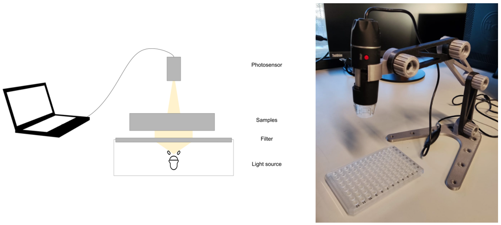

# Biofilm Imaging Station (BIS)

Light microscopy is the simplest and fastest microscopic technique for biofilm analysis, but bulky and expensive instruments are still required. To make this method more compact and affordable, we reproduced and tested a 3D-printed solution based on previous designs to replace conventional instrumentation. This station aims to facilitate the quantification of crystal-violet stained biofilm on multiwell plates while enabling method reproducibility. The current design emulates an upright microscope, where the sensor is above the multiwell plate while the illumination is placed below the plate.

## Features
- **3D printed modular stand for USB microscope:** The ability to capture images with sufficient contrast and clarity, particularly in small-scale applications, made the USB microscope better suited to biofilm image acquisition despite its lower resolution.
- **Light diffuser:** A piece of white acrylic can be placed between the multiwell and the light source to diffuse the light intensity and prevent saturation.
- **Light source:** TBD.

## Bill of Materials
### Electronics
- x1 [USB microscope](https://www.amazon.com/Microscope-Bysameyee-40X-1000X-Magnification-Endoscope/dp/B07BF86SRP/ref=sr_1_32_sspa?sr=8-32-spons&sp_csd=d2lkZ2V0TmFtZT1zcF9idGY&psc=1)

### Mechanics
- x4 [M5 nuts](https://www.mcmaster.com/products/nuts/thread-size~m5/hex-nuts~/metric-medium-strength-steel-hex-nuts-class-8/)
- x4 [M5x30 bolts with hex head](https://www.fixingsmegastore.co.uk/m5x30-hex-head-set-screw-stainless-steel)

### 3D printed parts
- x1 [base](https://github.com/Biofilm-Project/BIS/blob/main/STL/baseMINI.stl)
- x1 [mount](https://github.com/Biofilm-Project/BIS/blob/main/STL/mount.stl)
- x4 [knob](https://github.com/Biofilm-Project/BIS/blob/main/STL/knob.stl)
- x2 [arm 1](https://github.com/Biofilm-Project/BIS/blob/main/STL/arm-1.stl)
- x1 [arm 2](https://github.com/Biofilm-Project/BIS/blob/main/STL/arm-2.stl)

### Others
- x1 [5 mm white opaque acrylic sheet](https://www.canalplastic.com/products/7508-white-opaque-acrylic-sheet?variant=32920759054)
  
## References
- [Modular stand for electronic microscope](https://www.printables.com/model/48589-modular-stand-for-electronic-microscope) by Chrlee
- [USB Microscope Adapter for Modular Stand](https://www.printables.com/model/48594-usb-microscope-adapter-for-modular-stand) by Chrlee
- [Base of the modular microscope stand, fit to PrusaMini print bed](https://www.printables.com/model/165808-base-of-the-modular-microscope-stand-fit-to-prusam) by DaWoJnA
